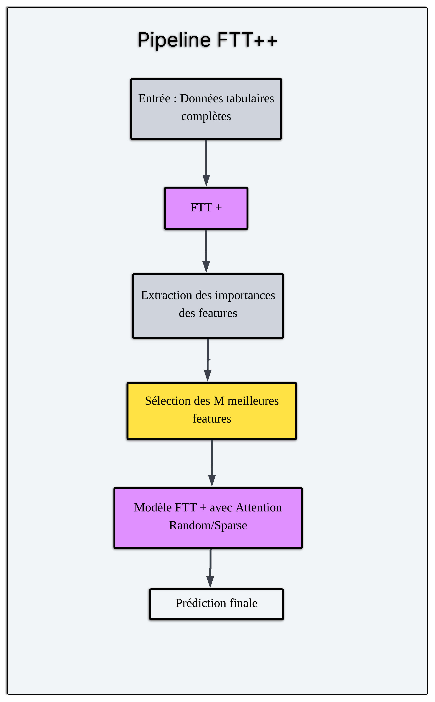

# FTT+ & FTT++ : Transformers interprétables pour données tabulaires

---

## Introduction

Ce dépôt propose deux architectures pour l’apprentissage sur données tabulaires :  
- **FTT+** (FT-Transformer Plus) : attention sélective et interprétable.
- **FTT++** (FT-Transformer Plus Plus) : sélection de features et attention randomisée.

L’objectif : concilier **performance** et **interprétabilité** sur des données structurées.

---

## 1. FTT+ : Forward Pass et Composants

> **Nouveauté : FTT+ supporte plusieurs schémas d'attention :**
> - `cls` : attention uniquement entre le token CLS et les features (FTT+ original)
> - `hybrid` : attention CLS↔features et features↔features (hors diagonale, par défaut)
> - `full` : attention complète entre toutes les positions (hors diagonale)
>
> Le mode par défaut est **`hybrid`** (interactions CLS↔features et features↔features).

### Schéma global du forward pass

<p align="center">
  
</p>
<p align="center"><b>Architecture globale du FT-Transformer appliqué aux données tabulaires</b></p>

1. **Tokenisation des features**  
   - `FeatureTokenizer` encode chaque variable (numérique/catégorielle) en vecteur dense.
   

   *Illustration du processus de tokenisation des variables brutes en vecteurs denses.*

2. **Ajout du token CLS**  
   - Un vecteur spécial, appris, est ajouté en tête de séquence.

3. **Passage dans les blocs Transformer**  
   - Chaque bloc applique :
     - **Interpretable Multi-Head Attention** :  
       - Q/K spécifiques à chaque tête, V partagée.
       - **Schéma d'attention flexible** :  
         - Par défaut, interactions CLS↔features **et** features↔features (hors diagonale).
         - Possibilité de forcer le mode `cls` (FTT+ original) ou `full` via la configuration.
       - Moyenne des scores d’attention sur les têtes pour interprétabilité directe.

       <p align="center">
         
       </p>
       <p align="center"><b>Scaled Dot-Product Attention : les interactions autorisées dépendent du mode choisi (`cls`, `hybrid`, `full`).</b></p>

       <br>

       <p align="center">
         
       </p>
       <p align="center"><b>Interpretable Multi-Head Attention : la moyenne des scores d’attention reflète l’importance réelle de chaque feature.</b></p>

     - **Feed-Forward Network (FFN)** :  
       - Transformation non-linéaire classique.
     - **Normalisation & Résidualité** :  
       - LayerNorm, skip connections.

   <p align="center">
     
   </p>
   <p align="center"><b>Vue d’ensemble d’un bloc Transformer adapté aux données tabulaires (FTT+)</b></p>

4. **Head de classification**  
   - Prédiction à partir du token CLS.

### Extraction de l’interprétabilité

- Importance des features : extraite directement de la matrice d’attention CLS→features (ou interactions selon le mode).
- Visualisations : barplots, heatmaps.

---

## 2. FTT++ : Pipeline en Deux Étapes

### Schéma global du pipeline

<p align="center">
  
</p>
<p align="center"><b>Pipeline FTT++ : sélection de features puis attention randomisée</b></p>

### Étape 1 : Sélection des M features importantes

- Entraînement d’un FTT+ sur toutes les features.
- **Le schéma d'attention utilisé est configurable (par défaut : `hybrid`).**
- Extraction des scores d’importance via attention CLS.
- Sélection des M features les plus importantes.

### Étape 2 : Modèle Random Sparse sur les M features

- Forward pass :
  1. **Sélection des features** dans les tenseurs d’entrée.
  2. **Tokenisation + CLS**.
  3. **Blocs Transformer à attention sparse** :
     - Attention entre CLS↔features.
     - k paires de features choisies aléatoirement (sparse random attention).
     - Pas d’auto-attention.
  4. **FFN et Head** identiques à FTT+.

- Extraction de l’interprétabilité :  
  Importance des features dans le modèle Random, visualisations sparse.

---

## 3. Visualisation & Analyse

- **Barplots** : importance des features (attention CLS).
- **Heatmaps** : interactions (attention complète ou sparse).
- **Export** : scores d’importance pour reporting/audit.

---

## 4. Structure du code

```
ftt_plus/
    attention.py         # Attention sélective/interprétable
    model.py             # Architecture FTT+ (tokenizer, CLS, blocs, head)
    visualisation.py     # Visualisation (barplots, heatmaps)

ftt_plus_plus/
    config/              # Configurations, mapping features
    core/                # Modèles FTT+, Random sparse, attention
    training/            # Entraînement étape 1 & 2
    pipeline/            # Orchestration pipeline FTT++
    visualisation/       # Visualisations avancées
    __init__.py          # Import centralisé
```

---

## Notes d'utilisation

- Pour changer le mode d'attention de FTT+, ajoutez dans la config :
  ```python
  ftt_plus_config = {
      # ...autres paramètres...
      'attention_mode': 'cls',  # ou 'hybrid', ou 'full'
  }
  ```
- Le pipeline FTT++ utilisera ce mode pour l'étape 1.

---

## 5. Pourquoi cette étude ?

- **Comprendre et expliquer les décisions des modèles tabulaires** : enjeu crucial en entreprise (banque, assurance, santé…).
- **Allier performance et transparence** : lever le « black box effect » des réseaux profonds.
- **Proposer des outils réutilisables et adaptables** : code modulaire, visualisations prêtes à l’emploi.

---

## 6. Références

- Vaswani, A., Shazeer, N., Parmar, N., et al. (2017). *Attention Is All You Need*. NeurIPS.
- Isomura, T., Shimizu, R., & Goto, M. (2023). *Optimizing FT-Transformer: Sparse Attention for Improved Performance and Interpretability*.
- Gorishniy, Y., Rubachev, I., Khrulkov, V., & Babenko, A. (2021). *Revisiting Deep Learning Models for Tabular Data*.
- Devlin, J., et al. (2018). *BERT: Pre-training of Deep Bidirectional Transformers for Language Understanding*.

---

## 7. Auteur

Léonel VODOUNOU  
FTT+ / FTT++ – Interprétabilité avancée pour données tabulaires  
2025

---
